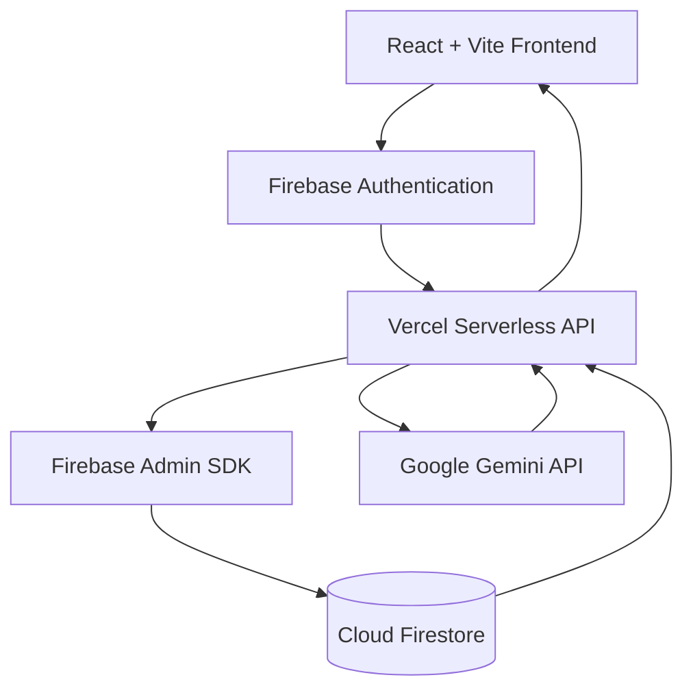
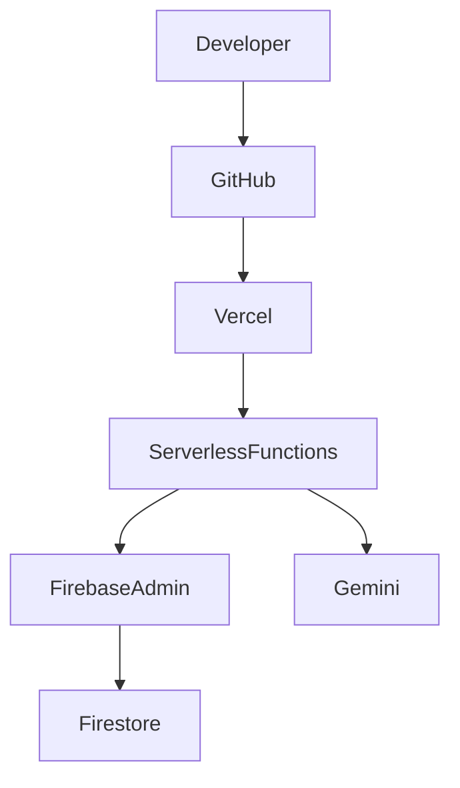

# ✨ BrandSpark.ai

> **AI-Powered Brand Identity Platform**
>
> Build complete brand identities—from names and taglines to brand books and visual assets—using Google's Gemini AI, Firebase, and Vercel Serverless.

---

## 🚀 Overview

BrandSpark.ai is a modern AI-powered SaaS application that helps entrepreneurs, startups, creators, and designers build a complete brand identity from a single workspace.

Instead of switching between multiple AI tools, BrandSpark.ai provides an integrated workflow where users can generate, manage, save, and export branding assets securely.

---

## 💡 Why BrandSpark.ai?

Building a memorable brand often requires multiple tools for naming, messaging, visual identity, and documentation.

BrandSpark.ai brings everything together into one intelligent platform.

It combines:

- React + TypeScript
- Firebase Authentication
- Cloud Firestore
- Vercel Serverless Functions
- Google Gemini AI

to deliver a secure, scalable, production-ready AI experience.

---

# ✨ Features

- AI Brand Name Generator
- AI Slogan Generator
- AI Tagline Generator
- Mission & Vision Generator
- Brand Story Generator
- Brand Voice Generator
- Logo Prompt Generator
- Color Palette Suggestions
- Typography Recommendations
- Brand Book Generator
- Asset History
- Google Authentication
- Firestore Cloud Storage
- Export & Save Assets

---

# 🏗 System Architecture



---

# 🤖 End-to-End AI Pipeline


---

# 🔐 Security Architecture

- Google OAuth Authentication
- Firebase Authentication
- Firebase Admin SDK (Server Side)
- Firestore Ownership Verification
- Server-side Gemini API Key
- Retry Mechanism
- Request Timeout Protection
- Structured JSON Validation

**The Gemini API key is never exposed to the browser.**

---

# ⚙️ Technology Stack

| Layer | Technology |
|------|------------|
| Frontend | React 19, TypeScript, Vite |
| Styling | Tailwind CSS |
| Backend | Vercel Serverless Functions |
| Authentication | Firebase Authentication |
| Database | Cloud Firestore |
| AI | Google Gemini |
| Hosting | Vercel |

---

# 📂 Project Structure

```text
BrandSpark.ai
├── api/
│   ├── generate-ai.js
│   └── generate-brand.js
├── functions/
├── public/
├── src/
│   ├── components/
│   ├── pages/
│   ├── services/
│   ├── lib/
│   ├── hooks/
│   ├── context/
│   └── utils/
├── firebase.json
├── vercel.json
├── package.json
└── README.md
```

---

# 🔄 Application Flow

```text
Google Login
      ↓
Dashboard
      ↓
Create Project
      ↓
Choose Generator
      ↓
Generate AI Content
      ↓
Gemini Response
      ↓
Render Results
      ↓
Save Assets
      ↓
Export
```

---

# 🚀 Deployment Architecture



---

# 💻 Local Development

## Clone

```bash
git clone https://github.com/Arnob07Mondal/BrandSpark.ai.git
cd BrandSpark.ai
```

## Install

```bash
npm install
```

## Environment Variables

Create `.env.local`

```env
VITE_BACKEND_MODE=vercel

VITE_FIREBASE_API_KEY=
VITE_FIREBASE_AUTH_DOMAIN=
VITE_FIREBASE_PROJECT_ID=
VITE_FIREBASE_STORAGE_BUCKET=
VITE_FIREBASE_MESSAGING_SENDER_ID=
VITE_FIREBASE_APP_ID=

GEMINI_API_KEY=

FIREBASE_SERVICE_ACCOUNT_KEY=
```

> Never commit secrets or `.env.local`.

## Run

```bash
npm run dev
```

## Production Build

```bash
npm run build
```

---

# ☁️ Deployment

1. Push to GitHub.
2. Import repository into Vercel.
3. Configure environment variables.
4. Deploy.
5. Configure Firebase Authorized Domains.
6. Verify AI generation.

---

# 🤝 Contributing

Contributions are welcome!

## Workflow

```text
Fork Repository
      ↓
Clone Fork
      ↓
Create Feature Branch
      ↓
Implement Feature
      ↓
Run npm run build
      ↓
Commit
      ↓
Push
      ↓
Open Pull Request
```

### Commands

```bash
git checkout -b feature/my-feature

git add .

git commit -m "Add my feature"

git push origin feature/my-feature
```

Please ensure:

- Build succeeds
- No secrets are committed
- Code is documented
- New features include appropriate documentation

---

# 🧪 Engineering Challenges & Lessons Learned

During development, BrandSpark.ai evolved through several architectural iterations.

Major challenges included:

| Challenge | Solution |
|-----------|----------|
| Firebase migration | Migrated to a new Firebase project and updated configuration |
| OAuth domains | Configured Firebase Authorized Domains for production |
| Cloud Functions | Migrated backend to Vercel Serverless |
| Gemini reliability | Implemented retries and timeout handling |
| Firestore security | Added ownership verification using Firebase Admin |
| Production builds | Resolved TypeScript and deployment issues |
| Environment management | Centralized configuration using environment variables |

These challenges significantly improved the application's reliability and maintainability.

---

# 🗺️ Roadmap

- ✅ AI Brand Generator
- ✅ Firebase Authentication
- ✅ Firestore Integration
- ✅ Vercel Deployment
- ✅ Asset Management
- ⬜ AI Logo Generation
- ⬜ AI Image Generation
- ⬜ Team Collaboration
- ⬜ Organization Workspaces
- ⬜ Multi-language Support
- ⬜ Analytics Dashboard

---

# 📸 Screenshots

> Add screenshots here.

```
docs/screenshots/dashboard.png
docs/screenshots/generator.png
docs/screenshots/assets.png
```

---

# 🎥 Demo

> Add a GIF or video demonstration here.

---

# ❤️ Acknowledgements

- Google Gemini
- Firebase
- React
- Vite
- Vercel
- Tailwind CSS
- Open Source Community

---

# 📜 License

This project is licensed under the **MIT License**.

See the `LICENSE` file for details.

---

# © Copyright

Copyright © 2026 Arnob Mondal.

Permission is granted to use, modify, and distribute this software under the terms of the MIT License.

---

# ⭐ Support

If you enjoyed this project:

- ⭐ Star the repository
- 🍴 Fork it
- 🐛 Report issues
- 🚀 Contribute improvements

---

## 🌟 The Journey

BrandSpark.ai is more than an AI project—it represents a complete engineering journey.

From Firebase migration and authentication issues to Vercel deployment, production debugging, Gemini integration, retry mechanisms, security improvements, and deployment automation, every obstacle helped shape a more reliable platform.

This repository reflects not only the final application but also the experience gained while building, debugging, deploying, and refining a modern AI-powered SaaS product.

---

<p align="center">
Built with ❤️ by <strong>Arnob Mondal</strong><br>
Powered by React • Firebase • Vercel • Google Gemini
</p>
